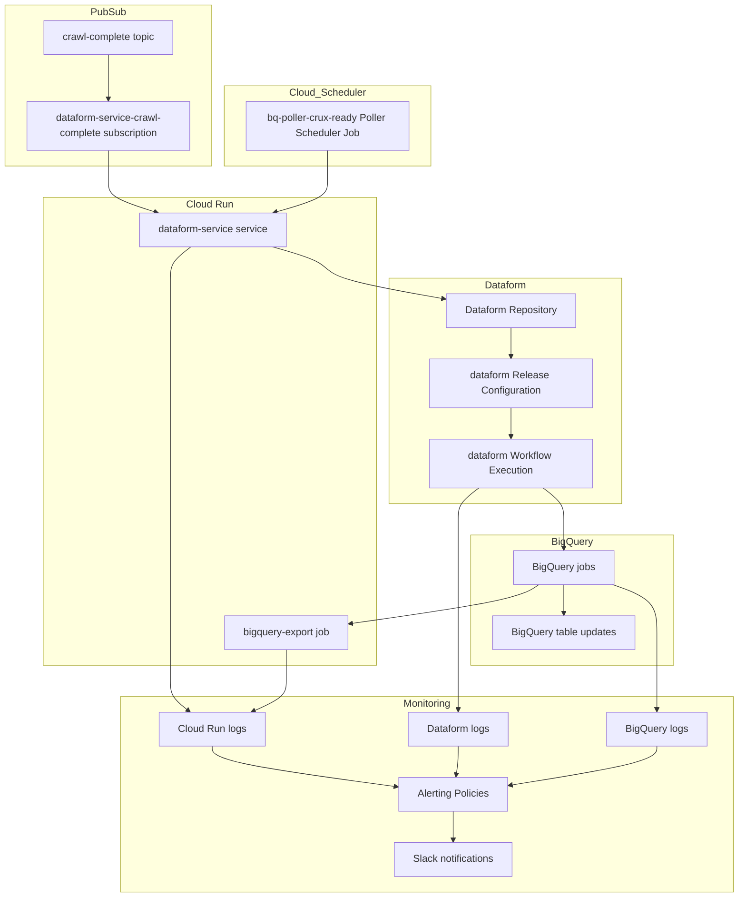

# HTTP Archive datasets pipeline

This repository handles the HTTP Archive data pipeline, which takes the results of the monthly HTTP Archive run and saves this to the `httparchive` dataset in BigQuery.

## Pipelines

The pipelines are run in Dataform service in Google Cloud Platform (GCP) and are kicked off automatically on crawl completion and other events. The code in the `main` branch is used on each triggered pipeline run.

### HTTP Archive Crawl

Tag: `crawl_complete`

- Crawl dataset `httparchive.crawl.*`

  Consumers:

  - public dataset and [BQ Sharing Listing](https://console.cloud.google.com/bigquery/analytics-hub/discovery/projects/httparchive/locations/us/dataExchanges/httparchive/listings/crawl)

- Blink Features Report `httparchive.blink_features.usage`

  Consumers:

  - [chromestatus.com](https://chromestatus.com/metrics/feature/timeline/popularity/2089)

### HTTP Archive Technology Report

Tag: `crux_ready`

- `httparchive.reports.cwv_tech_*` and `httparchive.reports.tech_*`

  Consumers:

  - [HTTP Archive Tech Report](https://httparchive.org/reports/techreport/landing)

## Schedules

1. [crawl-complete](https://console.cloud.google.com/cloudpubsub/subscription/detail/dataform-service-crawl-complete?authuser=2&project=httparchive) PubSub subscription

    Tags: ["crawl_complete"]

2. [bq-poller-crux-ready](https://console.cloud.google.com/cloudscheduler/jobs/edit/us-central1/bq-poller-crux-ready?authuser=7&project=httparchive) Scheduler

    Tags: ["crux_ready"]

### Triggering workflows

In order to unify the workflow triggering mechanism, we use [a Cloud Run function](./infra/README.md) that can be invoked in a number of ways (e.g. listen to PubSub messages), do intermediate checks and trigger the particular Dataform workflow execution configuration.

## Cloud resources overview



## Development Setup

1. Install dependencies:

    ```bash
    npm install
    ```

2. Available Scripts:

    - `npm run format` - Format code using Standard.js, fix Markdown issues, and format Terraform files
    - `npm run lint` - Run linting checks on JavaScript, Markdown files, and compile Dataform configs
    - `make tf_apply` - Apply Terraform configurations

## Code Quality

This repository uses:

- Standard.js for JavaScript code style
- Markdownlint for Markdown file formatting
- Dataform's built-in compiler for SQL validation
