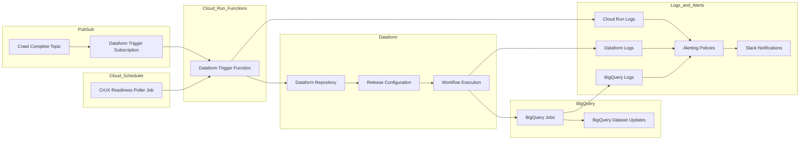

# Infrastucture

## Triggering pipelines

[Configuration](./tf/functions.tf)

### Cloud Run Function

Triggers the Dataform workflow execution, based on events or cron schedules.

- [dataformTrigger](https://console.cloud.google.com/functions/details/us-central1/dataformTrigger?env=gen2&project=httparchive)

[Source](./src/README.md)

### Cloud Scheduler

- [bq-poller-cwv-tech-report](https://console.cloud.google.com/cloudscheduler/jobs/edit/us-east4/bq-poller-cwv-tech-report?authuser=7&project=httparchive)

### Pub/Sub Subscription

- [dataform-trigger-subscription](https://console.cloud.google.com/cloudpubsub/subscription/detail/dataformTrigger?authuser=7&project=httparchive)

## Dataform

Runs the batch processing workflows. There are two Dataform repositories for [development](https://console.cloud.google.com/bigquery/dataform/locations/us-central1/repositories/crawl-data-test/details/workspaces?authuser=7&project=httparchive) and [production](https://console.cloud.google.com/bigquery/dataform/locations/us-central1/repositories/crawl-data/details/workspaces?authuser=7&project=httparchive).

The test reporsitory is used [for development and testing purposes](https://cloud.google.com/dataform/docs/workspaces) and not connected to the rest of the pipeline infra.

Pipeline can be [run manually](https://cloud.google.com/dataform/docs/code-lifecycle) from the Dataform UI.

[Configuration](./tf/dataform.tf)

### Dataform Development Workspace

1. [Create new dev workspace](https://cloud.google.com/dataform/docs/quickstart-dev-environments) in test Dataform repository.
2. Make adjustments to the dataform configuration files and manually run a workflow to verify.
3. Push all your changes to a dev branch & open a PR with the link to the BigQuery artifacts generated in the test workflow.

*Some useful hints:*

1. In workflow settings vars set `dev_name: dev` to process sampled data in dev workspace.
2. Change `current_month` variable to a month in the past. May be helpful for testing pipelines based on `chrome-ux-report` data.
3. `definitions/extra/test_env.sqlx` script helps to setup the tables required to run pipelines when in dev workspace. It's disabled by default.

## Monitoring

[Configuration](./tf/monitoring.tf)

### Dataform repository

- [Production Dataform Workflow Excution logs](https://console.cloud.google.com/bigquery/dataform/locations/us-central1/repositories/crawl-data/details/workflows?authuser=7&project=httparchive)
- [Logs Explorer](https://cloudlogging.app.goo.gl/k9qfqCh4RjFwTnQ56)

### Cloud Run logs

- [Trigger function logs](https://console.cloud.google.com/run/detail/us-central1/dataformtrigger/logs?authuser=7&project=httparchive)
- [Logs Explorer](https://cloudlogging.app.goo.gl/6Q879UjnTPDqtVBx5)

### BigQuery logs

- [Logs Explorer](https://cloudlogging.app.goo.gl/rFjRMcvejd1Tyi7KA)

### Alerting policies

- [Dataform Trigger Function Error](https://console.cloud.google.com/monitoring/alerting/policies/3950167380893746326?authuser=7&project=httparchive)
- [Dataform Workflow Invocation Failed](https://console.cloud.google.com/monitoring/alerting/policies/7137542315653007241?authuser=7&project=httparchive)

## CI/CD pipeline

### Dataform / GiHub connection

GitHub PAT saved to a [Secret Manager secret](https://console.cloud.google.com/security/secret-manager/secret/GitHub_max-ostapenko_dataform_PAT/versions?authuser=7&project=httparchive).

- repository: HTTPArchive/dataform
- permissions:
  - Commit statuses: read
  - Contents: read, write
